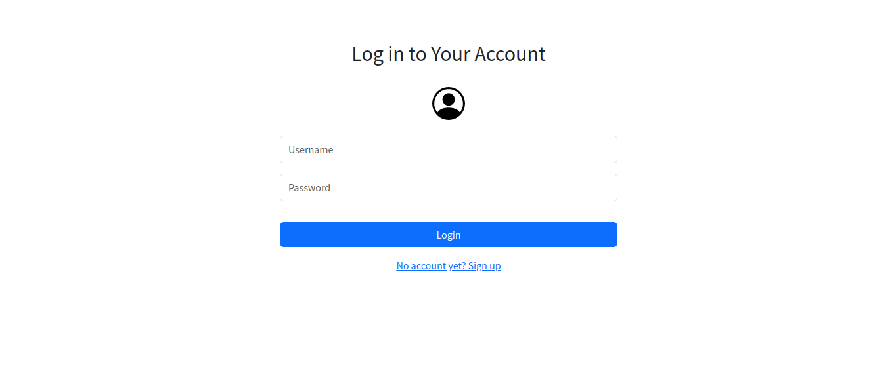
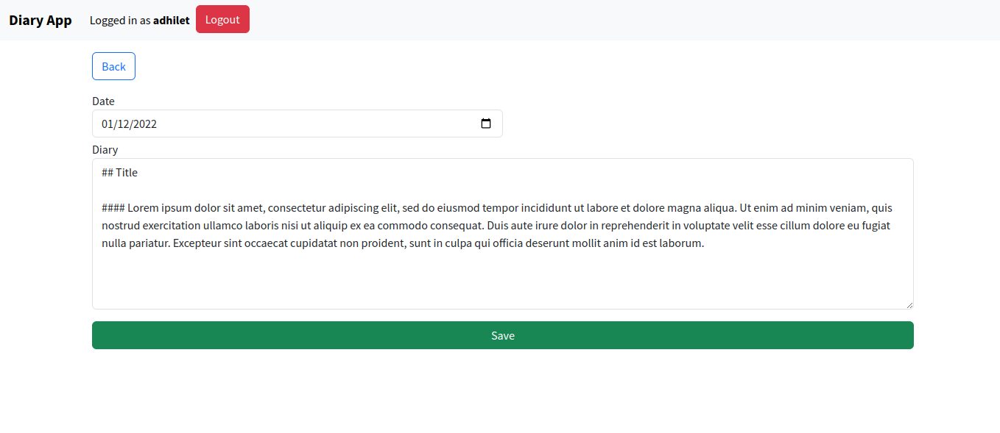

# **Diary App**

## About 
A simple web app to write your daily, and save. This project is being done as part of Tinkerhub Co-Coder Program
<br><br>

## Status
Work in Progress...

## How to Run


```
git clone https://github.com/adhilameenet/diaryapp-nodejs

```

```
cd diaryapp-nodejs

```
```
npm install

```
### Setup .env file

<table>
 <tr>
  <th>Variable</th>
  <th>Value ( Example ) </th>
 </tr>
 <tr>
     <td>PORT</td>
     <td>3000</td>
 </tr>
 <tr>
     <td>CONNECTION_STRING</td>
     <td>'mongodb://localhost/database'</td>
 </tr>
 <tr>
     <td>SESSION_SECRET</td>
     <td>'topsecret'</td>
 </tr>
</table>

```
npm start

```
## Built With
- Handlebars
- Bootstrap
- Node JS
- Express JS
- MongoDB

## Some Snaps
<br>
<br><br>
<br><br>

